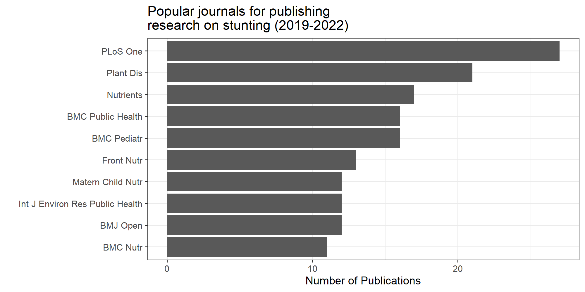
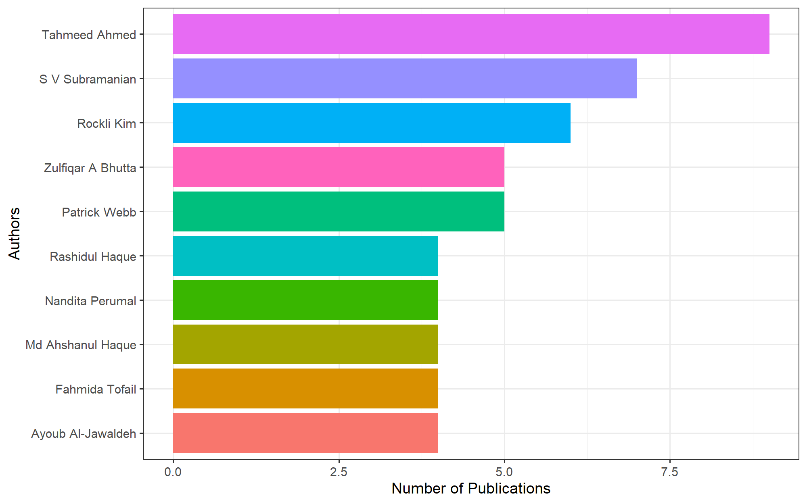
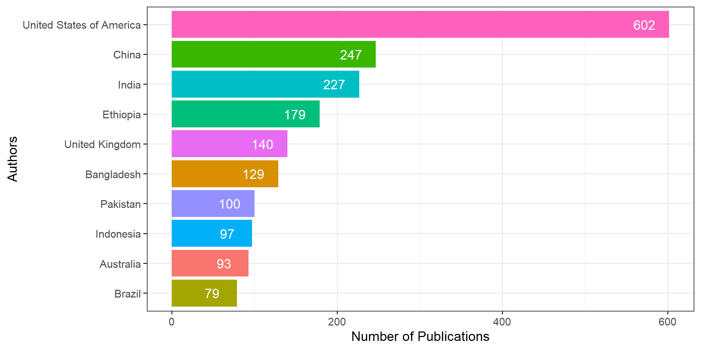

# Bibliometric Analysis with easyPubMed

## Load libraries

For this exercise, we will use a - `easyPubMed` to fetch publication
data from PubMed:
<https://pubmed.ncbi.nlm.nih.gov/?term=stunting&sort=date> - `tidyverse`
for tidy data wrangling - `rvest` for scrapping a website to retrieve
country names.

Remember to `install.packages()` if you have not installed these
packages already.

    library (easyPubMed)
    library (tidyverse)
    library (countrycode)
    library (rvest)

## PubMed Data Retreival

You’ll need to create a search query for research that includes the word
title in their abstract or title. These articles need to have been
published between 2019 and 2022.

Subsequently, we will use `get_pubmed_ids` to extract pubmed\_ids for
articles that match our query of interest.

The code chunk below will help us retrieve articles into R based on the
ids retrieved above.

      database <- fetch_pubmed_data(new_query)
      all_xml <- articles_to_list(database)

Below, we will create different databases, one with individual
publication records while the other includes a record of researchers
listed on each article and their respective affiliations.

      ## Create a dataframe with articles
      articleBase <- do.call(rbind, 
                             lapply(all_xml, 
                                    article_to_df,
                                    max_chars = -1,
                                    getAuthors = FALSE))
      
      ## Create a dataframe with all author information
      author_Base <- table_articles_byAuth(pubmed_data = database, 
                                       included_authors = "all", 
                                       max_chars = 0, 
                                       encoding = "ASCII")

    ## Processing PubMed data .................................................. done!

      ## We can view the top records using head()
      head (author_Base,1)

    ##       pmid               doi
    ## 1 35746780 10.3390/v14061310
    ##                                                                                                                                 title
    ## 1 Persistent, and Asymptomatic Viral Infections and Whitefly-Transmitted Viruses Impacting Cantaloupe and Watermelon in Georgia, USA.
    ##   abstract year month day  jabbrv journal
    ## 1          2022    06  24 Viruses Viruses
    ##                                                                                                                                                                                                              keywords
    ## 1 Georgia; USA; cantaloupe; cucumis melo amalgavirus (CmAV1); cucumis melo cryptic virus (CmCV); cucumis melo endornavirus (CmEV); persistent virus; watermelon; watermelon crinkle leaf-associated virus 1 (WCLaV-1)
    ##   lastname       firstname
    ## 1  Adeleke Ismaila Adeyemi
    ##                                                                       address
    ## 1 Department of Plant Pathology, University of Georgia, Tifton, GA 31793, USA
    ##   email
    ## 1  <NA>

      head (articleBase,1)

    ##       pmid               doi
    ## 1 35746780 10.3390/v14061310
    ##                                                                                                                                 title
    ## 1 Persistent, and Asymptomatic Viral Infections and Whitefly-Transmitted Viruses Impacting Cantaloupe and Watermelon in Georgia, USA.
    ##                                                                                                                                                                                                                                                                                                                                                                                                                                                                                                                                                                                                                                                                                                                                                                                                                                                                                                                                                                                                                                                                                                                                                                                                                                                                                                                                                                                                                                                                                                                                                                                                                                                                                                                                    abstract
    ## 1 Cucurbits in Southeastern USA have experienced a drastic decline in production over the years due to the effect of economically important viruses, mainly those transmitted by the sweet potato whitefly (<i>Bemisia tabaci</i> Gennadius). In cucurbits, these viruses can be found as a single or mixed infection, thereby causing significant yield loss. During the spring of 2021, surveys were conducted to evaluate the incidence and distribution of viruses infecting cantaloupe (<i>n</i> = 80) and watermelon (<i>n</i> = 245) in Georgia. Symptomatic foliar tissues were collected from six counties and sRNA libraries were constructed from seven symptomatic samples. High throughput sequencing (HTS) analysis revealed the presence of three different new RNA viruses in Georgia: cucumis melo endornavirus (CmEV), cucumis melo amalgavirus (CmAV1), and cucumis melo cryptic virus (CmCV). Reverse transcription-polymerase chain reaction (RT-PCR) analysis revealed the presence of CmEV and CmAV1 in 25% and 43% of the total samples tested, respectively. CmCV was not detected using RT-PCR. Watermelon crinkle leaf-associated virus 1 (WCLaV-1), recently reported in GA, was detected in 28% of the samples tested. Furthermore, RT-PCR and PCR analysis of 43 symptomatic leaf tissues collected from the fall-grown watermelon in 2019 revealed the presence of cucurbit chlorotic yellows virus (CCYV), cucurbit yellow stunting disorder virus (CYSDV), and cucurbit leaf crumple virus (CuLCrV) at 73%, 2%, and 81%, respectively. This finding broadens our knowledge of the prevalence of viruses in melons in the fall and spring, as well as the geographical expansion of the WCLaV-1 in GA, USA.
    ##   year month day  jabbrv journal keywords lastname firstname address email
    ## 1 2022    06  24 Viruses Viruses     <NA>     <NA>      <NA>    <NA>  <NA>

## Descriptive statistics

### Most popular journal

Below, we will use one of the databases created earlier to assess the
most popular journals publishing research on stunting. Can you guess
what database this might be? `author_Base` or `articleBase`?

      popular_jrnals <- articleBase %>% 
                        group_by(jabbrv) %>% 
                        count() %>% arrange(desc(n)) %>% 
                        ungroup () %>% 
                        slice (1:10)

      ## We can also plot the result using a bar plot.
      ## we used reorder(jabbrv, n) to arrange bars on the y-axis in descending order.
      popular_jrnals %>% 
        ggplot() + geom_col(aes(x = n,
                                y = reorder(jabbrv, n))) +
        theme_bw() + labs(y = "", x = "Number of Publications",
                          title = "Popular journals for publishing \nresearch on stunting (2019-2022)")

### Most popular authors

We can also use one of the databases created earlier to evaluate the
most popular authors that have been publishing on stunting between
2019-2022. Can you guess what database this might be? `author_Base` or
`articleBase`?

      popular_auths <- author_Base %>% 
                       ## Below, lets concatenate the the first and last names
                       mutate (full_name = paste0(firstname, " ", lastname)) %>% 
                        group_by(full_name) %>% 
                        count() %>% arrange(desc(n)) %>% 
                        ungroup () %>% 
                        slice (1:10)
      
      ## We can also plot our result using a bar plot.
      popular_auths %>% 
        ggplot() + geom_col(aes(x = n, 
                                y = reorder(full_name, n),
                                fill = full_name)) +
        theme_bw() + theme(legend.position = "none") +
        labs (y = "Authors", x = "Number of Publications")

### Most popular countries of affiliation

We can also use one of the databases created earlier to evaluate where
most of the authors are located. Can you guess what database this might
be? `author_Base` or `articleBase`?

    ## Below, we will extract countries of affiliation from the addresses provided in the database. We can use str_remove() to remove part of texts that we don't want and text that match a criteria.
      author_Base_updt <- author_Base %>% 
                          filter(doi !="") %>% 
                          mutate (country = str_remove(address, ".*, ")) %>% 
                          mutate (country = str_remove(country, pattern = "\\..*")) %>% 
                          mutate (country = str_remove(country, pattern = "[0-9]+"))

After a thorough cleaning, the affiliation of so many authors could
still not be recovered. We can create separate databases, one with
authors whose text for the country of affiliation is less than 25
characters and another database for those with more than 25 characters.

        auth_okay <- author_Base_updt %>% 
                     filter (str_length(country) < 25 & !is.na(country))
        auth_NotOkay <- author_Base_updt %>% 
                     filter (str_length(country) >= 25 & !is.na(country))

For the authors with countries of affiliation that are more than 25
characters, we could search within the texts for countries. We could do
this by first downloading/importing a table of countries into R and
subsequently checking our database line by line to see if we can extract
countries from the long texts in our database. Remember to use View()
whenever you need to understand what your codes are doing.

      url <- "https://www.worldometers.info/geography/alphabetical-list-of-countries/"
      countries <- url %>% read_html() %>% html_table() %>%.[[1]]

          for (n in 1:nrow(auth_NotOkay)) {
          
          ut <- sub("\\.", "", auth_NotOkay$country[n])
          
          for (i in 1:nrow(countries)) {
            
            if (str_detect(ut, countries$Country[i]) == TRUE) {
              
              auth_NotOkay$country[n] <- countries$Country[i]
              
              # cat(paste0("done ", countries$Country[i], "\n"))
              
              break
              
            }
            
          }
          
        }

We could also manually code countries that may have been spelt
differently or in another language, e.g. UK and United Kingdom. For
authors with no countries and just their affiliation, we could infer
their country of residence from their institutional affiliation,
e.g. John Hopkins University would be the US, and London School of
Tropical Medicine would be the UK.

      author_database <-  rbind(auth_NotOkay, auth_okay)  %>%
                          mutate (country = ifelse(str_detect(country, "Congo"),
                                                   "Democratic Republic of Congo",
                                                   country),
                                  country = ifelse(str_detect(country, "USA|Harvard|Johns Hopkins"),
                                                   "USA", country),
                                  country = ifelse(str_detect(country, "Korea"),
                                                   "Korea", country),
                                  country = ifelse(str_detect(country, "UK|London"),
                                                   "UK", country)) %>% 
        mutate (country = ifelse(str_detect(country, "Tropical|Research|University|Site|Subdirecci|Ministry|Hospital|Shahjalal|Zhejiang|Centre|Jawaharlal|Institute|Division|Department"),
                                 NA, country)) %>% 
        mutate (country = ifelse(str_detect(country, "UK"),
                                 "United Kingdom", country),
                country = ifelse(str_detect(country, "USA|United States"),
                                 "United States of America",
                                 country)) %>% 
        filter (!is.na(country) & country != "")

### Most popular country of affiliation

We can also use the updated information in the `author_Base` to count
the magnitude of knowledge production on stunting between 2019-2022
across the countries.

      popular_affCount <- author_database %>% 
                          group_by(country) %>% 
                          count() %>% arrange(desc(n)) %>% 
                          ungroup () %>% 
                          slice (1:10)
      
      popular_affCount %>% 
        ggplot() + geom_col(aes(x = n, 
                                y = reorder(country, n),
                                fill = country)) +
        geom_text(aes(x = n-30, 
                  y = reorder(country, n),
                  label = n),
                  color = "white") +
        theme_bw() + theme(legend.position = "none") +
        labs (y = "Authors", x = "Number of Publications")

### Number of authors and magnitude of international collaboration

We can also use information on the countries of affiliation to quantify
international collaborations among the authors per article. To achieve
this, we could count the number of unique countries for each paper. We
could also count the number of authors on each paper.

    n_authors <- author_database %>% 
                  group_by(title) %>% 
                  mutate (collabo = length(unique(country))) %>% 
                  ungroup () %>%
                  group_by (title) %>%
                  mutate (n_auth = length(title)) %>% 
                  slice(1) %>% 
                  select (doi, n_auth, collabo)

    ## Adding missing grouping variables: `title`

    ## Examine summary descriptive characteristics for the number of authors/paper
    summary(n_authors$n_auth)

    ##    Min. 1st Qu.  Median    Mean 3rd Qu.    Max. 
    ##   1.000   3.500   5.000   6.702   8.000 114.000

    ## Examine summary descriptive characteristics for the number of countries/paper
    summary(n_authors$collabo)

    ##    Min. 1st Qu.  Median    Mean 3rd Qu.    Max. 
    ##   1.000   1.000   1.000   1.879   2.000  33.000
